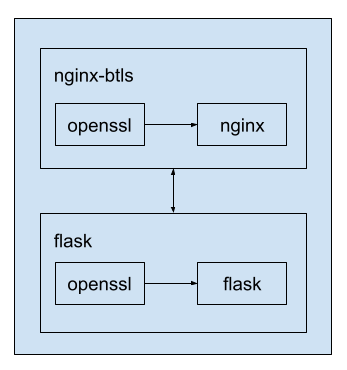

# Btls: The Transport Layer Security Protocol


[](https://github.com/bcrypto/btls/actions/workflows/build.yaml)

## What is Btls?

Btls is the informal name of STB 34.101.65, the official standard of Belarus.
Btls compiles several RFC that defines the 
[Transport Layer Security (TLS)](https://en.wikipedia.org/wiki/Transport_Layer_Security) 
protocol and its extensions legalizing 
[TLS 1.2](https://www.rfc-editor.org/rfc/rfc5246.txt) in Belarus.

Btls also defines 8 ciphersuites based on algorithms of 
[STB 34.101.31](https://github.com/bcrypto/belt) 
and [STB 34.101.45](https://github.com/bcrypto/bign).

## What is this repo?

In this repo, we process comments on the current version of Btls,
discuss future versions, provide additional supporting material.

The latest releases of Btls can be found at 
[Releases](https://github.com/bcrypto/btls/releases).

Comments and proposals are processed at 
[Issues](https://github.com/bcrypto/btls/issues). 

## Reference implementation

Ciphersuites of Btls are implemented [here](https://github.com/bcrypto/bee2evp) 
via a patch for [OpenSSL](https://github.com/openssl/openssl).

The ciphersuites can be used at the OpenSSL level with the `s_client` and 
`s_server` commands. They can also be used in model client and server 
environements that include:

* the [Epiphany](https://en.wikipedia.org/wiki/GNOME_Web) (GNOME Web) browser;
* the [Glib-networking](https://gitlab.gnome.org/GNOME/glib-networking) library;
* the [Nginx](https://en.wikipedia.org/wiki/Nginx) web server;
* the [Flask](https://en.wikipedia.org/wiki/Flask_(web_framework)) web framework.

### The client environment


Build:

```console
$ cd client
$ bash build_client.sh
$ cd ..
```

After build:

```console
$ export PREFIX=${PWD}/bee2evp/build/local
$ echo "export LD_LIBRARY_PATH=${PREFIX}/lib:$LD_LIBRARY_PATH" >> ${HOME}/.bashrc
$ echo "export PATH=${PREFIX}/bin:$PATH" >> ${HOME}/.bashrc
$ echo "export PKG_CONFIG_PATH=${PREFIX}/lib/pkgconfig" >> ${HOME}/.bashrc
$ echo "export CPATH=${PREFIX}/include:$CPATH" >> ${HOME}/.bashrc
$ echo "export OPENSSL_CONF=${PREFIX}/openssl.cnf" >> ${HOME}/.bashrc
$ echo "export GIO_MODULE_DIR=${PREFIX}/lib/x86_64-linux-gnu/gio/modules" >> ${HOME}/.bashrc
```
or run sh script:
```console
$ bash ./add_to_bashrc.sh
```

Connect to a server:

```console
$ epiphany https://<server>:<port>
\\ if server is local <server>=127.0.0.1
\\ port from {8443, 8444, 8445, 8446}
```

Alternative way (no need to change .bashrc):

```console
$ bash run_client.sh https://<server>:<port>
```

## The server environment



Requirements:

1. [docker](https://docs.docker.com/engine/install/ubuntu/);
2. [docker-compose](https://docs.docker.com/compose/install/).

Deploy:

```console
$ docker pull btls/btls256
$ docker pull btls/flask
$ docker-compose up -d btls256
```

Open 2 terminals.

In the first:
```console
$ docker exec -it btls256 bash
// in the docker shell
$ nginx -g "daemon off;" 
```
In the second:
```console
$ docker exec -it flask bash
// in the docker shell
$ flask run --host=0.0.0.0 --port=5000
```
